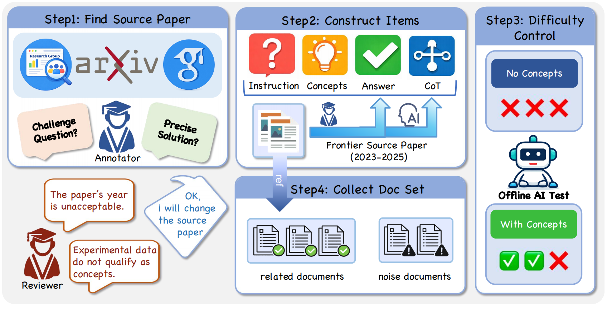
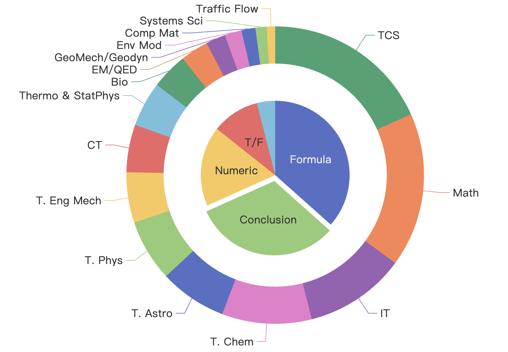

<h2 align="center" style="font-size: 2.5em; font-weight: bold; color: #2c3e50;">
<i>DeR²</i><br> Retrieval-Infused Reasoning Sandbox
</h2>

<p align="center">
<a href="https://retrieval-infused-reasoning-sandbox.github.io/" style="margin: 0 10px;">🌐 Homepage</a> |
<a href="#" style="margin: 0 10px;">🤗 Dataset</a> |
<a href="https://arxiv.org/abs/2601.21937" style="margin: 0 10px;">📖 ArXiv</a> |
<a href="https://github.com/Retrieval-Infused-Reasoning-Sandbox/Retrieval-Infused-Reasoning-Sandbox" style="margin: 0 10px;">🐙 GitHub</a>
</p>

This repository contains the dataset, evaluation suite, and documentation for the paper "**Retrieval-Infused Reasoning Sandbox: A Benchmark for Decoupling Retrieval and Reasoning Capabilities**".

---

## 🔔 Introduction

<p align="center">

</p>

**DER²** is a controlled frontier problems sandbox designed to evaluate how large language models (LLMs) reason over genuinely novel scientific information. Unlike standard benchmarks that evaluate end-to-end RAG pipelines, DER² **decouples evidence access from reasoning**. By isolating document-grounded reasoning, the benchmark preserves the core difficulties of deep search—multi-step synthesis, denoising, and evidence-based conclusion making—while preventing parametric leakage.

Key findings from our experiments show that many state-of-the-art models suffer from **mode-switch fragility** (performing worse with documents than without) and **structural concept misuse** (correctly naming concepts but failing to execute them as procedures).

---

## 🧩 Benchmark Overview

DER² adopts a rigorous construction pipeline to ensure scientific validity and high difficulty:

1. **Source Screening:** Documents are drawn from **2023-2025 theoretical papers** across 15+ disciplines (Math, Physics, CS, etc.) to prevent memorization.


2. **Expert Annotation:** All instances are authored by **PhD students** from top-tier universities, ensuring high-level academic quality.


3. **Two-Phase Validation:** 
* **Parametric Failure:** Models must fail to solve the instruction without evidence.

* **Oracle Solvability:** A correct solution must be achievable once oracle concepts are provided.


4. **Decoupled Evaluation Regimes:** Models are tested across four settings: **Instruction-only**, **Concepts-only**, **Related-only**, and **Full-set**.


---

## 📊 Dataset Statistics

<p align="center">

</p>

**Answer Types:** Numeric · Formula · Conclusion · Boolean · Symbolic Equivalence 

---

## 📦 Dataset Format

Each example in **DER²** follows a structured five-field format: instruction, concepts, CoT, answer, and doc_set.

**Field Descriptions:** 

* `instruction`: A high-level academic question requiring multi-step derivation.
* `concepts`: Necessary theoretical constructs/theorems required to solve the task.
* `CoT`: Expert-validated reasoning trace connecting concepts to the answer.
* `answer`: The concise artifact, scalar, or conclusion.
* `doc_set`: A frozen library containing relevant evidence and topically adjacent noise.

---

## 🧠 Evaluation Protocol

We provide fine-grained diagnosis by measuring three interpretable loss gaps:

1. **Knowledge Loss:** Gap between *Concepts-only* and *Instruction-only*.
2. **Retrieval Loss:** Gap between *Related-only* and *Concepts-only*.
3. **Noise-induced Loss:** Gap between *Full-set* and *Related-only*.

This enables researchers to identify whether a model is failing due to **missing the concept**, **failing to apply the concept**, or **noise-induced derailment**.

---

## 🏁 Main Results (Accuracy %)

| Model | Instruction-only | Full-set | Related-only | Concepts-only | RLoss |
| --- | --- | --- | --- | --- | --- |
| **OpenAI-GPT-5.2-high** | 65.8 | **71.1** | **71.4** | **83.8** | 12.7 |
| **Gemini-3-Pro-Preview** | 64.2 | 53.7 | 68.3 | 80.9 | 27.2 |
| **DeepSeek-V3.2-Exp** | 57.6 | 49.3 | 61.3 | 75.3 | 26.0 |
| **Average Score** | 55.9 | 51.2 | 62.9 | 75.4 | 24.2 |

Data indicates that providing gold concepts substantially improves outcomes, while noise documents significantly degrade performance.

---

## 📚 Citation

**BibTeX:**

```bibtex
@misc{der2_2026,
      title={Retrieval-Infused Reasoning Sandbox: A Benchmark for Decoupling Retrieval and Reasoning Capabilities},
      author={Shuangshuang Ying and Zheyu Wang and Yunjian Peng and Jin Chen and Yuhao Wu and Hongbin Lin and Dingyu He and Siyi Liu and Gengchen Yu and YinZhu Piao and Yuchen Wu and Xin Gui and Zhongyuan Peng and Xin Li and Xeron Du and Libo Qin and YiXin Cao and Ge Zhang and Stephen Huang}, 
      year={2026},
      archivePrefix={arXiv},
      primaryClass={cs.CL},
      url={https://retrieval-infused-reasoning-sandbox.github.io/}
}

```

